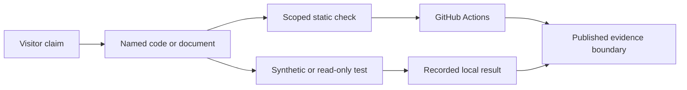

# Repository Overview

## Recommended path

```text
portfolio/
|-- README.md
|-- projects/
|   |-- ml_training_pipeline/v2/                 # current ML engineering evidence
|   |-- cv_wheat_disease_test_v1/                # current service contract
|   `-- stats_variance_correlation_pipeline_test_v1/  # current read-only gate
|-- docs/                                        # scope, method, provenance, policy
`-- .github/workflows/                           # scoped CI
```

Historical modules remain under their original paths but are not recommended runtimes:

- `projects/ml_training_pipeline/` outside `v2/`;
- `projects/cv_wheat_disease/`;
- `projects/stats_variance_correlation_pipeline/`;
- `projects/comfyui_workflows/`;
- `projects/system_tools/` and `projects/misc_tools/`.

## Verification flow



The CI path intentionally avoids real training data, historical workflow JSON, CSV/Excel/manifest contents, statistics, CLD, reports, and figures.

## Provenance and source CSV

- Current repository root: `D:\工作流\portfolio`
- Wheat source label: `<local-source>/wheat-disease-demo`
- ML source label: `<local-source>/ml-training`
- ComfyUI source label: `<local-source>/comfyui/workflows`
- Statistical original root: `D:\项目文件202605\制图数据`
- Source CSV: `data\clean\soil_core_variables_latest_long.csv`, `soil_core_variables_latest_v3_long.csv`, `soil_physicochemical_latest_v3_wide.csv`, `soil_physicochemical_latest_wide.csv` under that root.
- No CSV, Excel, manifest, statistic, CLD, weight, workflow, image metadata, or frozen figure was modified during this review.
