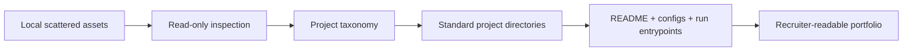

# System Overview

Source provenance:

- Current portfolio root: `portfolio`
- Original wheat demo: `<local-source>/wheat-disease-demo`
- Original ML training code: `<local-source>/ml-training`
- Original ComfyUI workflows: `<local-source>/comfyui/workflows`
- AutoHotkey runtime and scripts: `AutoHotkey v2 runtime`, `<local-source>/system-tools/autohotkey`
- Source CSV: none identified in the inspected asset sets

## Repository Map

```text
portfolio/
  README.md
  projects/
    cv_wheat_disease/       # CV inference demo and backend surface
    ml_training_pipeline/   # train/eval/inference ML structure
    comfyui_workflows/      # documented ComfyUI workflow packages
    system_tools/           # low-priority AutoHotkey utility
    misc_tools/             # support notes
  assets/
    images/                 # reference and sample images
    results/                # copied result screenshots/figures
    diagrams/               # architecture map
  docs/
    dataset_notes.md
    methodology.md
    system_overview.md
```

## High-Level Flow



## Risk Notes

- The wheat disease backend is a demo MVP unless a real model is connected through the existing adapter.
- The ML project includes weights and inference structure, but no new training metrics were generated.
- ComfyUI output images are copied conservatively and labeled according to traceability.
- AutoHotkey scripts are documented as a utility appendix and may require a v1-compatible runtime.
