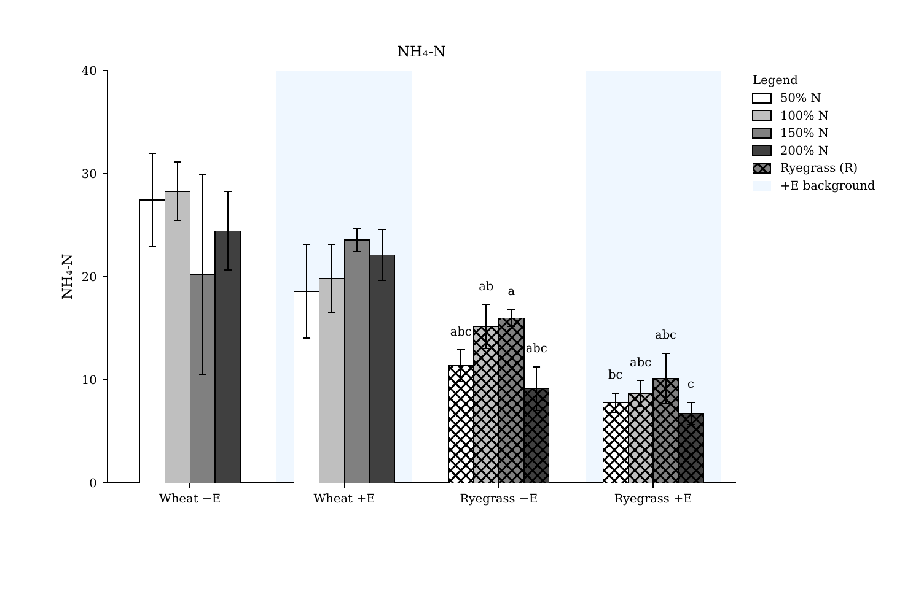
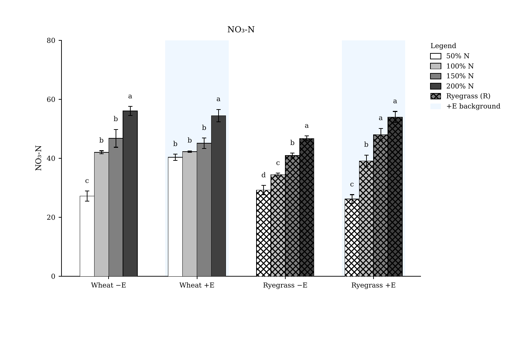
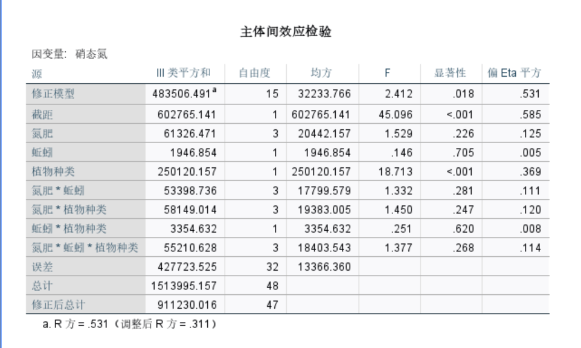

# Statistical Asset Pipeline — Historical Module

> **Read-only default:** the legacy entrypoint writes tracked catalogs, previews, summaries, and a PDF report. Do not run it in the current checkout. Use the [Statistical Assets Read-only Gate](../stats_variance_correlation_pipeline_test_v1/README.md) as the supported portfolio entry.

## What this module contains

This directory preserves a source-derived research asset package:

- exact copies of four clean CSV snapshots under `data/clean/`;
- selected frozen PDF/PNG result assets under `reference_results/original/`;
- historical packaging, visualization, report, and reusable table-analysis code;
- a source inventory that distinguishes historical evidence from generic future-use functions.

The historical scan found variance-analysis, cleaning, plotting, and PDF-export code. It did not identify a clear first-party historical correlation-matrix script after filtering; correlation helpers in `src/table_methods.py` are generic functions for explicitly supplied future data, not evidence of a frozen historical correlation result.

## Supported review path

```powershell
python projects/stats_variance_correlation_pipeline_test_v1/check_plan_test_v1.py --strict
python -m unittest discover -s projects/stats_variance_correlation_pipeline_test_v1/tests -p "test*_test_v1.py" -v
```

These checks inspect paths only. They do not open CSV values, recompute ANOVA/Tukey/CLD, create correlation matrices, render figures, or rewrite reports.

## Frozen examples

- `reference_results/original/Fig_NH4N_methodB2v2_01.pdf`
- `reference_results/original/Fig_NO3N_methodB2v2_01.pdf`
- `reference_results/original/SPSS_NO3-N.png`

Committed preview assets:







## Legacy execution boundary

The preserved `run_pipeline.py` can overwrite tracked catalog, summary, preview, and report paths. It is retained for provenance, not offered as a safe default command. A future regeneration should use a disposable checkout or newly designed output directory after separate review; this portfolio pass does not perform that regeneration.

## Provenance and source CSV

- Original root: `D:\项目文件202605\制图数据`
- Approved scientific result source: `D:\项目文件202605\制图数据\科研用图_B2v2v3`
- SPSS result source: `D:\项目文件202605\制图数据\SPSS原数据图片`
- Source CSV:
  - `D:\项目文件202605\制图数据\data\clean\soil_core_variables_latest_long.csv`
  - `D:\项目文件202605\制图数据\data\clean\soil_core_variables_latest_v3_long.csv`
  - `D:\项目文件202605\制图数据\data\clean\soil_physicochemical_latest_v3_wide.csv`
  - `D:\项目文件202605\制图数据\data\clean\soil_physicochemical_latest_wide.csv`
- Detailed asset mapping: [`source_asset_inventory.md`](source_asset_inventory.md)
- No CSV, Excel, manifest, statistic, CLD, historical report, or frozen figure was modified during this review.
